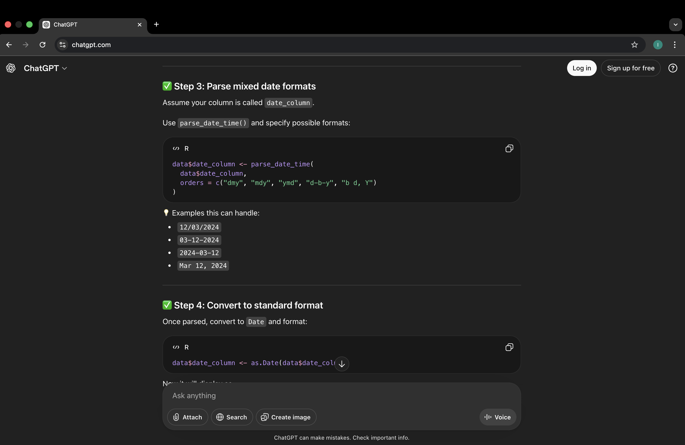

## *The Usage of AI:*

I mainly used AI (ChatGPT) as a troubleshooting tool while cleaning and processing my data. It helped me understand and fix error messages in R, particularly when I was trying to standardise date formats. My dataset had dates in different formats, so AI suggested ways to make them consistent. I also used it for smaller tasks like tagging figures. Screenshots of these interactions have been included below.

